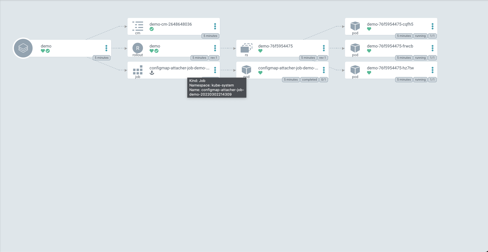

# How to: **Kubernetes Configmap Versioning** on Canary Deployments
Before we start, let’s assume you know about Kubernetes, [Argocd](https://argo-cd.readthedocs.io/en/stable/), and the concept of Canary deployments (or A/B).

## Introduction
In Kubernetes, the default and basic way for performing a version upgrade is by changing the image tag - this will create a new ReplicaSet. Based on the Deployment configuration, Kubernetes will terminate pods from the old ReplicaSet and create pods on the new ReplicaSet. When performing a Deployment or Statefulset upgrade, you don’t have the ability to use complicated strategies like Canary or A/B. For that, you’ll have to deploy another controller, such as Argo Rollouts, Flagger, Spinnaker, or any other controller with those abilities. Here, I’ll discuss performing the Canary deployments using [Argo Rollouts](https://argoproj.github.io/argo-rollouts/).


We run most of our Kubernetes nodes on Spot instances and we perform our deployments using Argo rollouts. Our rollout strategy is pretty simple - we use a Canary deployment, where we replace one pod in the service and pause. Once the new pod is up, we perform manual tests, and if the tests succeeded, we continue to 100% rollout.

Once we started using this Canary strategy, we figured we also needed to revise our Configmaps during the Canary deployments.

## Infrastructure overview:
1. We maintain our in-house Helm chart.
2. We use the following Argo Rollouts Canary strategy:

```yaml
strategy:
  canary:
    maxSurge: 0
    maxUnavailable: 1
    steps:
    - setWeight: 1
    - pause: {}
```
3. To trigger the Deployment based on Configmap changes, we use the [Automatically Roll Deployments](https://helm.sh/docs/howto/charts_tips_and_tricks/#automatically-roll-deployments) annotation on our Rollout object:

```yaml
kind: Rollout
  spec:
    template:
      metadata:
        annotations:
          checksum/config: '{{ include (print $.Template.BasePath "/configmap.yaml") . | sha256sum }}'
[...]
```
## Default behaviour
1. We start a canary deployment by changing the Configmap.
2. The Configmap is updated and a new ReplicaSet is created.
3. The pod from the new ReplicaSet is created and loads the new Configmap.
4. The Configmap is faulty and the pod doesn’t work as expected.
5. The service owner notices the issue and starts an investigation.
6. During the investigation, there are spot replacements in the cluster, and other pods from the old ReplicaSet are restarted.

## The problem
**When pods from the old ReplicaSet are restarted, they read a new Configmap - if the Configmap is faulty, it can cause the pods to have issues.**

## The solution - **Configmaps Versioning**:
To solve this problem, we needed to create revised Configmaps - this how we built the full lifecycle:
- Create a unique name of each Configmap that changes every deployment. We added an epoch timestamp to the Configmap name.

    With a Configmap name that changes with every deployment, we ran into two issues:
    - Mounting the revisioned Configmap: it was impossible to mount the Configmaps using a static name because the name is generated during Helm rendering.

        To solve it, we implemented an auto-mount mechanism in our Helm chart using the same timestamp.
    - Cleanup of old Configmaps: Using a different name for every deployment resulted in leftovers of old Configmaps.

      To solve it, we created a post-install job that runs as part of every Canary deployment. That job receives the names of the revised Configmaps that were created during the deployment.

      That job attaches each Configmap to the deployment’s ReplicaSet using ownerReferences.

      **Attaching the Configmaps to the ReplicaSets using [ownerReferences](https://kubernetes.io/docs/concepts/overview/working-with-objects/owners-dependents/) allowed us to utilize the same [cleanup process that Kubernetes performed](https://kubernetes.io/docs/concepts/architecture/garbage-collection/) for ReplicaSets on our Configmaps.**


## Example:
The following example is done using a mini version of our [Helm chart](https://github.com/liorfranko/base-app)
1. We'll start by deploying our Helm chart:


The chart creates:
- A Rollout object, with ReplicaSet `demo-76f5954475` and 3 pods.
- A Configmap named `demo-cm-2648648036`
- A Configmap-attacher-job called `configmap-attacher-job-demo-20220302214309`

We'll start by viewing the ownerReferences of one of the pods:
```
kubectl -n devops-apps-01 get pods demo-76f5954475-cqfh5 -o json | jq '.metadata.ownerReferences'
[
  {
    "apiVersion": "apps/v1",
    "blockOwnerDeletion": true,
    "controller": true,
    "kind": "ReplicaSet",
    "name": "demo-76f5954475",
    "uid": "90083c29-b58c-4c25-b097-0f170ef59ba1"
  }
]
```
We can see that the Configmap has the same ownerReferences to the ReplicaSet, this was done by the Configmap-attacher-job.
```
kubectl -n devops-apps-01 get cm demo-cm-2648648036 -o json | jq '.metadata.ownerReferences'
[
  {
    "apiVersion": "apps/v1",
    "blockOwnerDeletion: true,
    "controller: true,
    "kind: "ReplicaSet",
    "name: "demo-76f5954475",
    "uid: "90083c29-b58c-4c25-b097-0f170ef59ba1"
  }
]
```
Let's take a look at the whole Configmap:
```
kubectl -n devops-apps-01 get cm demo-cm-2648648036 -o yaml
apiVersion: v1
data:
  configuration.json: |2-

    {
      "general": {
        "projectName": "demo service",
      }
    }
  key-1: value-1
kind: ConfigMap
metadata:
  creationTimestamp: "2022-03-02T21:43:09Z"
  labels:
    app: demo
    argocd.argoproj.io/instance: demo
  name: demo-cm-2648648036
  namespace: devops-apps-01
  ownerReferences:
  - apiVersion: apps/v1
    blockOwnerDeletion: true
    controller: true
    kind: ReplicaSet
    name: demo-76f5954475
    uid: 90083c29-b58c-4c25-b097-0f170ef59ba1
  resourceVersion: "323126811"
  selfLink: /api/v1/namespaces/devops-apps-01/configmaps/demo-cm-2648648036
  uid: 71b7f271-5e44-443b-959f-27c1d0f2d6b7
```
We can also see the auto-mounting of the Configmap on the pod:
```
kubectl -n devops-apps-01 get pods demo-76f5954475-cqfh5 -o json | jq '.spec.volumes[0]'
{
  "name": "configmaps-volume",
  "projected": {
    "defaultMode": 420,
    "sources": [
      {
        "configMap": {
          "name": "demo-cm-2648648036"
        }
      }
    ]
  }
}
kubectl -n devops-apps-01 get pods demo-76f5954475-cqfh5 -o json | jq '.spec.containers[0].volumeMounts[0]'
{
  "mountPath": "/etc/kubernetes/configmaps",
  "name": "configmaps-volume"
}
kubectl -n devops-apps-01 exec -it demo-76f5954475-cqfh5 bash -- ls -l /etc/kubernetes/configmaps
total 0
lrwxrwxrwx 1 root root 25 Mar  2 21:43 configuration.json -> ..data/configuration.json
lrwxrwxrwx 1 root root 12 Mar  2 21:43 key-1 -> ..data/key-1
 ~  kubectl -n devops-apps-01 exec -it demo-76f5954475-cqfh5 bash -- cat /etc/kubernetes/configmaps/configuration.json

{
  "general": {
    "projectName": "demo service",
  }
}
```

2. Now let's perform a change in the Configmap.

- We can see that a new ReplicaSet is created - `demo-58f56d4967`
- We can see that a new Configmaps is created - `demo-cm-557795215`
- We can see that the Configmap from the first deploy `demo-cm-2648648036`, is now shown below the old ReplicaSet `demo-76f5954475`
- We can see a new version of the Configmap-attacher-job - `configmap-attacher-job-demo-20220302220158`

We can see that the new Configmap is attached to the new ReplicaSet
```
kubectl -n devops-apps-01 get pods demo-58f56d4967-8kcwp -o json | jq '.metadata.ownerReferences'
[
  {
    "apiVersion": "apps/v1",
    "blockOwnerDeletion": true,
    "controller": true,
    "kind": "ReplicaSet",
    "name": "demo-58f56d4967",
    "uid": "76a7970c-862d-4ff5-a387-cc41a367308c"
  }
]
```
The most important part at this point is the mounting of the Configmaps, let's compare the mounting of an old pod versus a new pod:
```
kubectl -n devops-apps-01 get pods demo-76f5954475-frwcb -o json | jq '.spec.volumes[0]'
{
  "name": "configmaps-volume",
  "projected": {
    "defaultMode": 420,
    "sources": [
      {
        "configMap": {
          "name": "demo-cm-2648648036"
        }
      }
    ]
  }
}
kubectl -n devops-apps-01 get pods demo-58f56d4967-8kcwp -o json | jq '.spec.volumes[0]'
{
  "name": "configmaps-volume",
  "projected": {
    "defaultMode": 420,
    "sources": [
      {
        "configMap": {
          "name": "demo-cm-557795215"
        }
      }
    ]
  }
}
```
Let's simulate a spot replacement by deleting one of the old pods
```
kubectl -n devops-apps-01 delete pods demo-76f5954475-frwcb
pod "demo-76f5954475-frwcb" deleted
```

```
kubectl -n devops-apps-01 get pods demo-76f5954475-6sdbb -o json | jq '.spec.volumes[0]'
{
  "name": "configmaps-volume",
  "projected": {
    "defaultMode": 420,
    "sources": [
      {
        "configMap": {
          "name": "demo-cm-2648648036"
        }
      }
    ]
  }
}
```
We can see that even thought we deployed a new Configmap in the cluster, old pods that are restarted use the old Configmaps.

3. Let's promote the Rollout.

    All pods were moved from the old ReplicaSet to the new ReplicaSet
    
4. Let's create another change in the Configmap.
    
    We can see another revioned Configmap, another ReplicaSet, another Configmap-attacher-job.

    We can see that the Configmap from the old deployment were moved below the old ReplicaSet.
5. Let's promote the Rollout.

    All pods were moved from the old ReplicaSet to the new ReplicaSet
    
6. Let's simulate Kubernete GC, by deleting the old ReplicaSets `demo-76f5954475` and `demo-58f56d4967`.
    ```
    kubectl -n devops-apps-01 get cm | grep demo
    demo-cm-183520271                         4      5m5s
    demo-cm-2648648036                        2      42m
    demo-cm-557795215                         3      23m
    ```

    ```
    kubectl -n devops-apps-01 delete replicasets.apps demo-76f5954475 demo-58f56d4967
    replicaset.apps "demo-76f5954475" deleted
    replicaset.apps "demo-58f56d4967" deleted
    ```

    ```
    kubectl -n devops-apps-01 get cm | grep demo
    demo-cm-183520271                         4      5m31s
    ```

We can see that old Configmaps were successfully deleted!


## Summary
Because we utilized Configmap versioning, we can easily see the changes of the configurations, we're protected from spot interruptions during the Canary deployment, and we can easily perform rollbacks.


## Links
* [Argocd](https://argo-cd.readthedocs.io/en/stable/)
* [Argo Rollouts](https://argoproj.github.io/argo-rollouts/)
* [Automatically Roll Deployments](https://helm.sh/docs/howto/charts_tips_and_tricks/#automatically-roll-deployments)
* [ownerReferences](https://kubernetes.io/docs/concepts/overview/working-with-objects/owners-dependents/)
* [Cleanup process that Kubernetes performed](https://kubernetes.io/docs/concepts/architecture/garbage-collection/)
* [Demo Helm chart](https://github.com/liorfranko/base-app)
